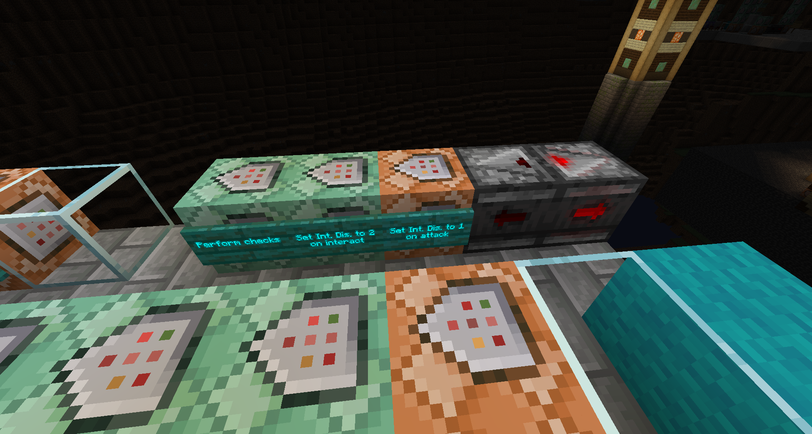

Below are various systems on the server along with how they work.

## Tribe Change

Players may change their tribe every 14 days, starting from when they join for the first time and resetting when they change their tribe. There is a hall at the bottom of the Hub where players can re-enter the tribe selection if their cooldown period is over. Their cooldown is reset after leaving the tribe change area, whether they make a change or not. Players can run `/tribechange` to get their remaining cooldown time.

Player tribe change cooldowns are stored on the `TribeChangeCooldown` scoreboard objective. The system is controlled by a set of command blocks in the admin cave. `.global` is increased by one every second to count time. Player scores are compared with this global counter to determine cooldown. `.max_cooldown` is the duration in seconds that the cooldown should be. Every time `.global` is increased by one, `.cooldown_end` is calculated by subtracting `.max_cooldown` from `.global`. After a tribe set or change, a player's score is set to the current `.global` score. Players cannot enter the tribe selection area until their score is less than `.cooldown_end`, which means that the number of seconds of `.max_cooldown` must pass before they can be allowed again.

Note that this system may not always be accurate, as it only runs as well as the server does. This means that, if the server is down, `.global` will not increase at all, and if the server is running slower than normal, it will increase slowly.

## Block Pit

The block pit is operated with very simple controls: punch the floating block to switch the material in the pit to the one below the block, or interact with the block to simply refill the pit.

In the image above we can see how this system operates: when a player punches a block, that block is given a score of 1, and when they interact with it the block instead gets a score of 2. // TODO
